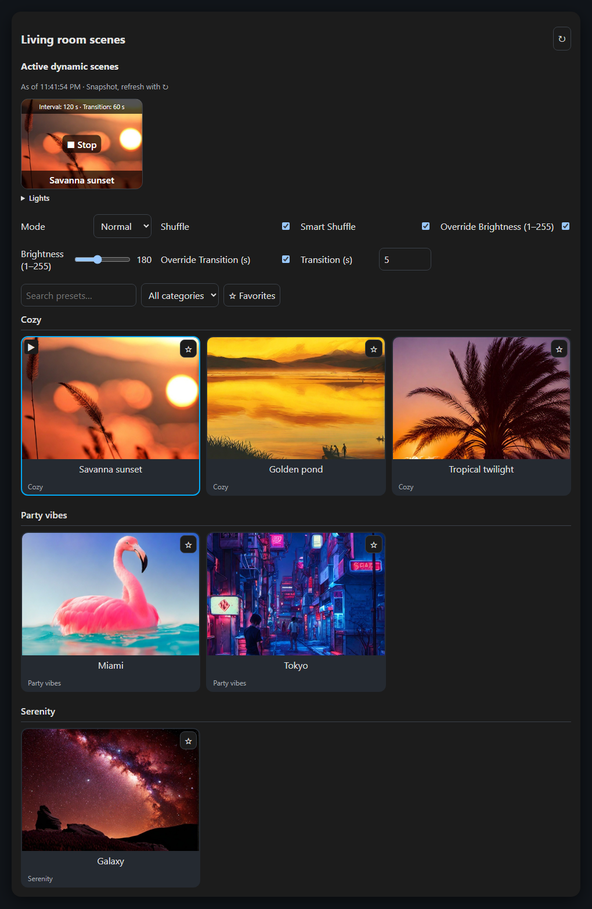
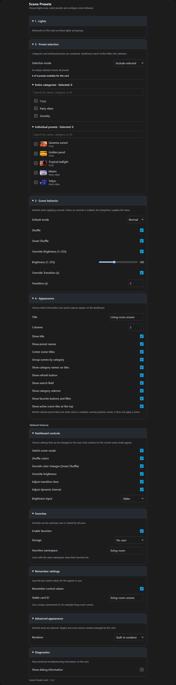

# Scene Presets Card

[](https://www.buymeacoffee.com/drivin)

A Home Assistant dashboard card for [Scene Presets](https://github.com/Hypfer/hass-scene_presets). Choose your lights once and browse, filter and apply presets without duplicating entity IDs or action configurations for every scene.

## Features

- Automatically discovers presets, categories and images, including custom presets published by the integration.
- Normal and dynamic scenes, with optional brightness and transition overrides.
- Include/exclude filters, search, favorites and a category selector that hides categories without eligible presets.
- Optional category headings, centered scene titles and a hideable refresh button.
- Visual editor with collapsible sections and native Home Assistant entity selection.
- Per-user or shared favorites, plus optional saved control values.
- Running dynamic scenes as image tiles at the top of the card; tap a tile to stop that scene.
- Built-in rendering, with optional `custom:button-card` or another Lovelace child card.
- Suggested by the card picker when adding a supported light entity.
- English, German, Dutch and French, following the Home Assistant user's language.

The card delegates lighting behavior to Scene Presets. It does not run its own scene engine.

## Preview

Maximally configured card using real Scene Presets metadata and artwork, rendered in dark mode:



Visual editor for the same configuration:



## Installation

### Prerequisite

Install and **activate** [Scene Presets](https://github.com/Hypfer/hass-scene_presets). The integration contract used by this card was verified against **2.4.0**.

Installing the integration's files through HACS is only the first step. In Home Assistant, open **Settings → Devices & services → Add integration**, search for **Scene Presets**, and complete setup.

### Install with HACS

1. Open HACS in Home Assistant and select **Dashboard**.
2. Open the menu, choose **Custom repositories**, and add the following repository as category **Dashboard**:

   ```text
   https://github.com/drivin/scene-presets-card
   ```

3. Search for **Scene Presets Card** and select **Download**.
4. Reload the browser. If HACS does not add the dashboard resource automatically, add `/hacsfiles/scene-presets-card/scene-presets-card.js` as a **JavaScript module** under **Settings → Dashboards → Resources**.

For updates, use HACS and then reload the browser without cache.

### Install the card manually

1. Download the prebuilt [`scene-presets-card.js`](scene-presets-card.js) file from the latest GitHub release or from this repository. On GitHub, use **Download raw file**.
2. Copy it to `<config>/www/scene-presets-card/scene-presets-card.js`.
3. Add a dashboard resource with type **JavaScript module**:

   ```text
   /local/scene-presets-card/scene-presets-card.js?v=1.2.2
   ```

4. Reload the dashboard page, edit the dashboard and add **Scene Presets**.

Only the single JavaScript file is required. Translations and the editor are bundled; no build step or CDN is needed for installation. If you created the `www` directory for the first time, restart Home Assistant to make `/local` available.

To update, replace the file, change the version parameter on the **existing** resource and reload the entire dashboard page. Register the resource only once. The editor footer should show **Scene Presets Card · 1.2.2**.

## Quick start

```yaml
type: custom:scene-presets-card
targets:
  entity_id:
    - light.living_room
```

By default, the card shows all presets and running dynamic scenes, uses normal scene mode and leaves brightness and transition values to the integration. The active-scene panel can be hidden in the visual editor under **Appearance**. You can configure everything in the visual editor.

## Configuration example

```yaml
type: custom:scene-presets-card
title: Living room
targets:
  entity_id:
    - light.ceiling
    - light.floor_lamp
filter:
  mode: exclude
  categories: []
  presets: []
scene:
  mode: normal
  shuffle: true
  smart_shuffle: true
  brightness:
    override: true
    value: 80
  transition:
    override: true
    value: 5
controls:
  mode: true
  shuffle: true
  smart_shuffle: true
  brightness: true
  brightness_input: slider
  transition: true
  interval: true
favorites:
  enabled: true
  mode: user
  namespace: living_room
remember:
  controls: true
storage_key: living-room-scenes
display:
  columns: 3
  show_title: true
  show_name: true
  center_titles: true
  group_by_category: true
  show_category: false
  show_refresh: true
  search: true
  category_selector: true
  favorites: true
  active_scene: true
```

### Filtering and category sections

Select category and preset IDs in the editor:

| Filter mode | Result | Empty selection |
| --- | --- | --- |
| `include` | Selected categories **plus** individually selected presets | No presets |
| `exclude` | All presets **minus** selected categories and individually selected presets | All presets |

Search, favorites and category navigation operate within this selection. The category dropdown includes only categories with at least one preset allowed by the configuration. Category headings appear only when that section has visible presets after all current filters. Missing configured IDs remain in the configuration and are reported in the editor.

### Normal and dynamic scenes

`scene.mode` selects the default mode when the card loads. The visual editor exposes it as **Default mode**. If the dashboard mode control is enabled together with `remember.controls`, a stored valid runtime mode takes priority. With the dashboard mode control disabled, the configured default is always used.

For normal scenes, `brightness.override` and `transition.override` control whether the card sends those values. Brightness uses **1–255**, not percentages. Set an override to `false` to leave that value to the integration.

When the dashboard brightness control is enabled, `controls.brightness_input` selects either the existing `number` field (default) or a `slider`. The visual editor exposes this choice under **Dashboard controls**.

For dynamic scenes, use intervals and transitions in seconds:

```yaml
scene:
  mode: dynamic
  interval: 120
  dynamic_transition: 60
```

Shuffle, Smart Shuffle, target resolution and conflicts between running dynamic scenes are handled by the integration.

### Appearance and refresh

| Option | Default | Purpose |
| --- | --- | --- |
| `display.show_title` | `true` | Show the card title |
| `display.center_titles` | `false` | Center scene titles in the built-in renderer |
| `display.group_by_category` | `false` | Separate visible presets with category headings |
| `display.show_category` | `false` | Also show the category name on each tile |
| `display.show_refresh` | `true` | Show the ↻ refresh button |
| `display.active_scene` | `true` | Show running dynamic scenes as image tiles at the top of the card; tap a tile to stop it. Configurable in the visual editor |

Refresh reloads preset metadata and, when `display.active_scene` is enabled, the dynamic scene status. The panel shows scenes started elsewhere as well as scenes started by this card. Each active tile shows the preset image, name, interval and transition; tapping it stops only that dynamic scene. Status updates after this card's actions and about every 30 seconds while the card is open. The displayed time identifies the last successful status check. **Refresh does not apply a scene.**

### Favorites and saved controls

Favorites are stored in Home Assistant, shared across browsers and devices for the same user:

- `favorites.mode: user`: separate favorites per Home Assistant user.
- `favorites.mode: global`: everyone can read; only administrators can change favorites.
- Cards using the same mode and namespace share a list. The default namespace is `default`.
- Live synchronization uses Home Assistant storage subscriptions when available; otherwise favorites refresh on load.

Enable `remember.controls` to save the user's last control values. This requires a unique, stable `storage_key`; changing the key starts with the configured scene defaults. Runtime changes do not rewrite the dashboard configuration.

### Optional external renderer

The built-in renderer requires no other cards. For Button Card:

```yaml
preset_card:
  type: custom:button-card
  template: scene_preset
```

Install Button Card and define the referenced template first. It receives `variables.preset` (`id`, `name`, `picture`, `categoryId`, `categoryName`, `favorite`, `active`) and `variables.card.sceneMode`. Targets and actions remain managed by Scene Presets Card. A missing renderer produces a message and falls back to built-in tiles.

Other child cards use their own configuration contract. External renderers control their own text alignment; category sections also work with external renderers.

## Languages

| Language | Code |
| --- | --- |
| English — default and fallback | `en` |
| German / Deutsch | `de` |
| Dutch / Nederlands | `nl` |
| French / Français | `fr` |

The card and editor follow the language selected in your **Home Assistant user profile**. Regional variants such as `de-DE`, `nl-BE` and `fr-CA` use their base language. Unsupported languages and missing translations fall back to English. There is no separate card language setting.

Labels, tooltips, accessibility text, validation messages and integration setup hints are translated. Preset names, category names and custom titles are preserved. Error details originating from Home Assistant or another integration retain their original language.

The additional languages are an initial selection, **not a verified ranking of the three most-used Home Assistant UI languages**: the public [Home Assistant Analytics](https://analytics.home-assistant.io/) data reviewed for this release did not provide such a ranking.

Contributions are welcome: see [translation development](docs/LOCALIZATION.md).

## Troubleshooting

**Preset endpoint unavailable / HTTP 404:** first check that the Scene Presets integration is activated under Devices & services. If it is already configured, check whether it loaded successfully and whether a reverse proxy blocks its asset path. Retry in the editor or use ↻.

**The editor or card still looks old:** replace the bundled JavaScript file, update the resource URL to `?v=1.2.2` and reload the entire page. Earlier releases used separate source imports; the current bundle contains everything. Check the version in the editor footer or enable `debug: true`.

**A category seems to be missing:** it needs at least one preset allowed by this card's include/exclude configuration. Empty category sections are also hidden after search and favorites filtering.

**Dynamic status looks outdated:** it is a snapshot, refreshed on load, after this card's actions and using ↻. There is no background polling.

## Known limitations

- The status panel shows the dynamic scenes reported by the integration. Active tile highlighting checks direct target overlap; group membership is not recalculated locally.
- The integration rereads custom preset files after a Home Assistant restart. Refresh then reloads the data it publishes.
- Preset metadata is cached across card instances. It is revalidated on the next load after 60 seconds, or immediately with ↻.
- Concurrent favorite changes on separate devices use Home Assistant's last-write-wins storage behavior.
- Missing storage or subscription APIs are reported; applying presets remains available where the integration supports it.
- Browser tests use simulated Home Assistant APIs. Physical lights and real third-party card installations require a live check.

## Development

Use Node.js **22 or newer**:

```sh
npm ci
npm run build
npm test
npx playwright install --with-deps chromium
npm run test:browser
npm run test:cache
```

Edit the modules in `src/`, then rebuild the generated `scene-presets-card.js`. The build rejects runtime JavaScript imports. Source strings live in `src/localize/*.json` and are bundled into the release.

Additional documentation: [configuration reference](docs/CONFIGURATION.md), [external interfaces](docs/EXTERNAL-DEPENDENCIES.md), [localization guide](docs/LOCALIZATION.md), and [changelog](CHANGELOG.md). All documentation is in English.

Contributions are welcome. See [CONTRIBUTING.md](CONTRIBUTING.md). Security issues should be reported as described in [SECURITY.md](SECURITY.md).

## License

Licensed under the [Apache License, Version 2.0](LICENSE). The prebuilt JavaScript bundle also includes the full license text.

Home Assistant, Scene Presets, Button Card and development tools are separate projects with their own licenses. This card does not bundle the integration or its preset images.

## Credits

Built for [Home Assistant](https://www.home-assistant.io/) and [Hypfer's Scene Presets integration](https://github.com/Hypfer/hass-scene_presets). This is an independent custom card.
